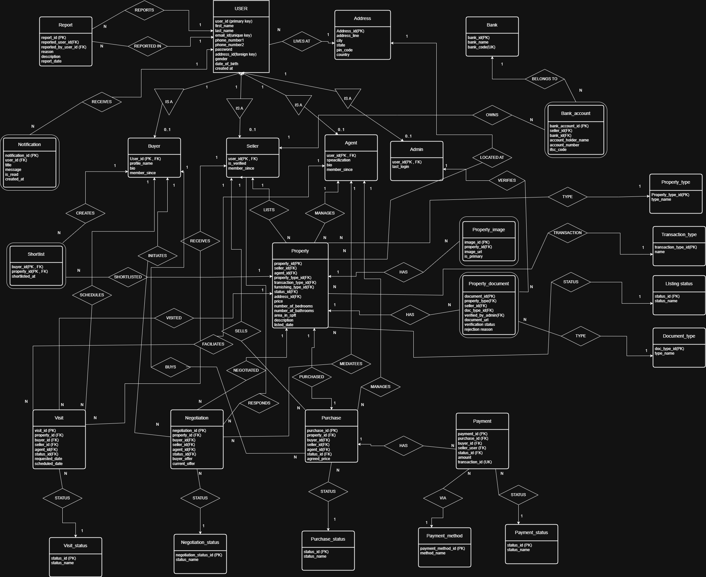

# ER Diagram – Real Estate Marketplace

## Introduction

This document describes the Entity Relationship (ER) model for the **Real Estate Marketplace System**.
The platform allows buyers to explore properties, schedule visits, negotiate prices, and purchase properties.
Sellers and agents manage property listings, while administrators verify documents and maintain the system.

The ER model defines the entities, attributes, and relationships required to manage users, properties, transactions, visits, negotiations, and payments.

---

# Core Entities

## User

Represents any person using the platform.

Attributes:

* user_id (Primary Key)
* first_name
* last_name
* email (Unique)
* phone_number
* password
* address_id (Foreign Key)
* gender
* date_of_birth
* created_at

---

## Address

Stores location details of users.

Attributes:

* address_id (Primary Key)
* address_line
* city
* state
* pin_code
* country

Relationship:

* A **User lives at one Address**
* One **Address can belong to many Users**

---

# User Roles

Users can take different roles in the system.

## Buyer

Represents users who purchase properties.

Attributes:

* user_id (Primary Key, Foreign Key)
* profile_name
* bio
* member_since

---

## Seller

Represents users who list properties.

Attributes:

* user_id (Primary Key, Foreign Key)
* is_verified
* member_since

---

## Agent

Agents help facilitate property transactions.

Attributes:

* user_id (Primary Key, Foreign Key)
* specialization
* bio
* member_since

---

## Admin

Administrators manage and verify system activities.

Attributes:

* user_id (Primary Key, Foreign Key)
* last_login

---

# Property Related Entities

## Property

Represents a real estate listing.

Attributes:

* property_id (Primary Key)
* seller_id (Foreign Key)
* agent_id (Foreign Key)
* property_type_id (Foreign Key)
* transaction_type_id (Foreign Key)
* furnishing_type_id (Foreign Key)
* status_id (Foreign Key)
* address_id (Foreign Key)
* price
* number_of_bedrooms
* number_of_bathrooms
* area_in_sqft
* description
* listed_date

Relationships:

* Seller **lists** properties
* Agents **manage** properties
* Properties **have images and documents**

---

## Property Image

Stores images associated with properties.

Attributes:

* image_id (Primary Key)
* property_id (Foreign Key)
* image_url
* is_primary

---

## Property Document

Stores documents related to property verification.

Attributes:

* document_id (Primary Key)
* property_id (Foreign Key)
* seller_id (Foreign Key)
* doc_type_id (Foreign Key)
* verified_by_admin (Foreign Key)
* document_url
* verification_status
* rejection_reason

---

# Property Classification Entities

## Property Type

Attributes:

* property_type_id (Primary Key)
* type_name

Examples:

* Apartment
* Villa
* Plot
* Commercial Property

---

## Transaction Type

Attributes:

* transaction_type_id (Primary Key)
* name

Examples:

* Sale
* Rent

---

## Listing Status

Attributes:

* status_id (Primary Key)
* status_name

Examples:

* Available
* Sold
* Rented
* Under Negotiation

---

## Document Type

Attributes:

* doc_type_id (Primary Key)
* type_name

Examples:

* Ownership Document
* Tax Document
* Approval Certificate

---

# Buyer Interaction Entities

## Shortlist

Stores properties shortlisted by buyers.

Attributes:

* buyer_id (Foreign Key)
* property_id (Foreign Key)
* shortlisted_at

Relationship:

* Buyers can shortlist multiple properties

---

## Visit

Represents scheduled property visits.

Attributes:

* visit_id (Primary Key)
* property_id (Foreign Key)
* buyer_id (Foreign Key)
* seller_id (Foreign Key)
* agent_id (Foreign Key)
* status_id (Foreign Key)
* requested_date
* scheduled_date

---

## Visit Status

Attributes:

* status_id (Primary Key)
* status_name

Examples:

* Requested
* Scheduled
* Completed
* Cancelled

---

# Negotiation and Purchase

## Negotiation

Represents price negotiations between buyers and sellers.

Attributes:

* negotiation_id (Primary Key)
* property_id (Foreign Key)
* buyer_id (Foreign Key)
* seller_id (Foreign Key)
* agent_id (Foreign Key)
* status_id (Foreign Key)
* buyer_offer
* seller_offer
* current_offer

---

## Negotiation Status

Attributes:

* negotiation_status_id (Primary Key)
* status_name

Examples:

* Open
* Accepted
* Rejected
* Closed

---

## Purchase

Represents finalized property purchases.

Attributes:

* purchase_id (Primary Key)
* property_id (Foreign Key)
* buyer_id (Foreign Key)
* seller_id (Foreign Key)
* agent_id (Foreign Key)
* status_id (Foreign Key)
* agreed_price

---

## Purchase Status

Attributes:

* status_id (Primary Key)
* status_name

Examples:

* Pending
* Completed
* Cancelled

---

# Payment System

## Payment

Represents payments made for property purchases.

Attributes:

* payment_id (Primary Key)
* purchase_id (Foreign Key)
* buyer_id (Foreign Key)
* seller_user (Foreign Key)
* status_id (Foreign Key)
* amount
* transaction_id (Unique)

---

## Payment Method

Attributes:

* payment_method_id (Primary Key)
* method_name

Examples:

* Bank Transfer
* Credit Card
* UPI

---

## Payment Status

Attributes:

* status_id (Primary Key)
* status_name

Examples:

* Pending
* Completed
* Failed

---

# Banking System

## Bank

Attributes:

* bank_id (Primary Key)
* bank_name
* bank_code (Unique)

---

## Bank Account

Stores seller bank details.

Attributes:

* bank_account_id (Primary Key)
* seller_id (Foreign Key)
* bank_id (Foreign Key)
* account_holder_name
* account_number
* ifsc_code

Relationship:

* Sellers own bank accounts
* Bank accounts belong to a bank

---

# Reports and Notifications

## Report

Users can report issues or suspicious activities.

Attributes:

* report_id (Primary Key)
* reported_user_id (Foreign Key)
* reporter_user_id (Foreign Key)
* reason
* description
* report_date

---

## Notification

System notifications sent to users.

Attributes:

* notification_id (Primary Key)
* user_id (Foreign Key)
* message
* is_read
* created_at

---

# ER Diagram

The following diagram illustrates the relationships between all entities in the system.

---

# Design Notes

* The database schema follows **normalization principles up to BCNF**.
* Role-based specialization is implemented using **ISA relationships**.
* Foreign keys maintain referential integrity between entities.
* Separate lookup tables are used for **statuses and types** to maintain normalization.
* The system supports the full property lifecycle: **listing → visit → negotiation → purchase → payment**.
